  
  &nbsp;
  
  &nbsp;
  

---

## About me

- M.S. Computer Science @ CU Boulder
- AI Specialist Intern @ PROJXON
- Building AI-enabled backend + automation systems
- AWS Certified Solutions Architect - Associate (SAA-C03)

## Tech Stack

  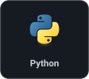
  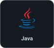
  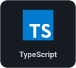
  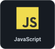
  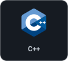
  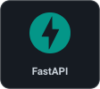

  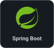
  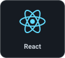
  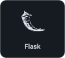
  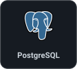
  
  

  
  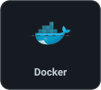
  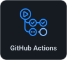
  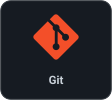
  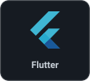

---

## Featured Projects

<table>
  <tr>
    <td width="50%" valign="top">
      <h3>IncidentPilot</h3>
      
Grounded CI/test-failure investigation with redaction, verified evidence and approval-gated GitHub actions.

      
<code>Python</code> · <code>FastAPI</code>

      
<a href="https://github.com/AruruGunabhiram/IncidentPilot">View repo →</a>

    </td>
    <td width="50%" valign="top">
      <h3>OrkaFin</h3>
      
Permission-aware, source-grounded recruiting guidance with explicit action confirmation.

      
<code>Python</code> · <code>FastAPI</code> · <code>SQLite</code>

      
<a href="https://github.com/AruruGunabhiram/OrkaFin">View repo →</a>

    </td>
  </tr>
  <tr>
    <td width="50%" valign="top">
      <h3>SocialLens</h3>
      
Full-stack YouTube analytics with public-data ingestion and daily metric snapshots.

      
<code>Java</code> · <code>Spring Boot</code> · <code>React</code> · <code>PostgreSQL</code>

      
<a href="https://github.com/AruruGunabhiram/SocialLens">View repo →</a>

    </td>
    <td width="50%" valign="top">
      <h3>Clinical Reconciliation</h3>
      
LLM-assisted medication reconciliation prototype with deterministic scoring and structured validation.

      
<code>Python</code> · <code>FastAPI</code> · <code>React</code>

      
<a href="https://github.com/AruruGunabhiram/clinical-reconciliation">View repo →</a>

    </td>
  </tr>
</table>

---

## Currently building

**Ember** - a private personal workflow system: durable task state, policy routing, and an approval + dry-run gate before anything runs.

`Python` · `FastAPI` · `SQLite`

  Open to Software Engineering, Applied AI and Agent Systems roles · Boulder, Colorado

