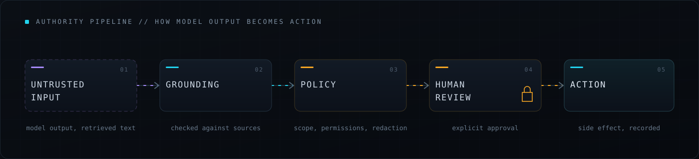

<h1 align="center">Gunabhiram Aruru</h1>

<p align="center">
  <strong>Software Engineer · Applied AI · Agent Systems</strong>
</p>

<p align="center">
  M.S. Computer Science @ University of Colorado Boulder<br />
  AI Specialist Intern @ PROJXON<br />
  AWS Certified Solutions Architect – Associate (SAA-C03)
</p>

<p align="center">
  <a href="https://arurugunabhiram.github.io/"></a>
  &nbsp;
  <a href="https://www.linkedin.com/in/gunabhiram-aruru/"></a>
  &nbsp;
  <a href="mailto:gunabhiram.a@gmail.com"></a>
</p>

---

## `SYSTEM://NOW`

```yaml
building:
  - durable, replayable AI workflows
  - deterministic guardrails on models
  - dry-run first, human-approved
  - evidence-grounded backend services

exploring:
  - agent architectures, control planes
  - reliable LLM integration
  - structured output validation
  - workflow automation and dev tooling

principle: |
  model output is an input to a
  controlled workflow, not authority
```

---

## Featured Systems

### Ember



Durable personal workflow control plane with policy, approvals, dry-run boundaries, and persistent orchestration. Every unit of work is a durable row, recovery is part of the state machine, and no external side effect happens without passing a policy gate.

`Python` · `FastAPI` · `SQLite` · `SQLAlchemy` · `Alembic` · `idempotency + dedupe`

> `private build · active development` — local-first personal project. The model layer is a provider abstraction with deterministic mock execution; no live LLM provider is wired in, and it is not an autonomous job-application agent.

### IncidentPilot



Grounded CI/test-failure investigation with redaction, verified evidence and approval-gated GitHub actions. Repository reads are path-confined, secrets are redacted before anything is written, and evidence is re-read rather than trusted from memory.

**→ [github.com/AruruGunabhiram/IncidentPilot](https://github.com/AruruGunabhiram/IncidentPilot)**

`Python` · `FastAPI` · `deterministic log analysis` · `confidence gates` · `optional LLM narrative refinement`

> **Scope:** local-first. It investigates and reports — it does not remediate on its own. An optional Gemini pass may refine wording; the deterministic report remains authoritative.

### OrkaFin



Permission-aware, source-grounded recruiting guidance with deterministic authority boundaries and explicit action confirmation. Context is resolved from trusted sources, fields are redacted per permission, and actions are revalidated at the moment of confirmation.

**→ [github.com/AruruGunabhiram/OrkaFin](https://github.com/AruruGunabhiram/OrkaFin)**

`Python` · `FastAPI` · `SQLite` · `permission model` · `grounding validation`

> **Scope:** locally runnable prototype against a synthetic ATS environment — not an autonomous agent and not a live production integration. An optional LLM adapter handles wording only.

---

## More Engineering

### [SocialLens](https://github.com/AruruGunabhiram/SocialLens)

Full-stack YouTube analytics with public-data ingestion, persistent metric snapshots and trend visualization. Daily snapshots are retained so trends are measured rather than estimated.

`Java` · `Spring Boot` · `React` · `TypeScript` · `PostgreSQL` · `Flyway` · `YouTube Data API`

### [Clinical Reconciliation](https://github.com/AruruGunabhiram/clinical-reconciliation)

LLM-assisted medication reconciliation prototype with deterministic scoring, structured validation and fallback behavior. Records are supplied manually; the deterministic path stays intact when the model path is unavailable.

`Python` · `FastAPI` · `React` · `Anthropic Claude` · `Pydantic` · `Docker`

> **Scope:** prototype only. No EHR integration, no FHIR/HL7, and not clinically validated decision support.

---

## Engineering Philosophy



The systems above keep converging on the same shape. A model's output arrives as **untrusted input**. It is **grounded** against real sources, constrained by **policy** — scope, permissions, redaction — and, wherever it would cause a real side effect, it waits for **human review** before it becomes an **action**.

I build AI-enabled systems this way because the interesting engineering is not the model call. It is everything that decides whether the model's answer is allowed to matter: what it is checked against, what it is permitted to touch, and who signs off before anything changes.

Not every project implements all five stages identically — this is the pattern I design toward, not a uniform checklist.

---

## Experience

- **AI Specialist Intern** — PROJXON · Jun 2026 – Present
- **Software Engineer Intern** — InfiniAI Technologies Pvt. Ltd. · Aug 2024 – Jan 2025 · Hyderabad, India

## Leadership · Education · Certification

- **President of Outreach** — Graduate and Professional Student Government, University of Colorado Boulder · Apr 2026 – Present
- **M.S. Computer Science** — University of Colorado Boulder · Aug 2025 – May 2027
- **AWS Certified Solutions Architect – Associate** — SAA-C03

---

## Tech Stack

**Languages** — `Python` · `Java` · `TypeScript` · `JavaScript`

**Backend / Systems** — `FastAPI` · `Spring Boot` · `Node.js`

**Frontend** — `React`

**Data** — `PostgreSQL` · `SQLite`

**Infrastructure** — `AWS` · `Docker` · `GitHub Actions`

**Applied AI** — LLM integration · agent workflows · grounding and structured outputs

---

<p align="center">
  <a href="https://arurugunabhiram.github.io/">Portfolio</a>
  &nbsp;·&nbsp;
  <a href="https://www.linkedin.com/in/gunabhiram-aruru/">LinkedIn</a>
  &nbsp;·&nbsp;
  <a href="mailto:gunabhiram.a@gmail.com">gunabhiram.a@gmail.com</a>
</p>

<p align="center">
  <sub>Open to Software Engineering, Applied AI and Agent Systems roles · Boulder, Colorado</sub>
</p>
